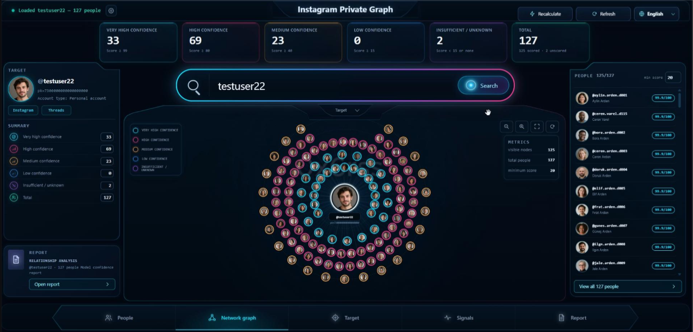
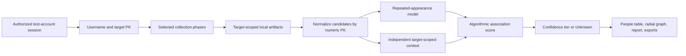

The academic and technical details of this project will soon be presented to the literature by [@Root0ne](https://github.com/Root0ne). The idea for the project was inspired by his work. Many thanks to [@Root0ne](https://github.com/Root0ne).

# Instagram OSINT Relationship Analysis

This project is a local research application for the social-media portion of
authorized OSINT investigations. It collects information visible to an
authenticated Instagram session, stores evidence locally, and produces a
ranked candidate list, radial network visualization, target summary, signal
summary, and human-readable report.

The final purpose is to assist case triage, hypothesis generation, and
corroboration in legitimate OSINT work. It is not an identity-resolution
system, follower-list bypass, surveillance service, or source of factual
relationship declarations.

## Interface preview



## Read this before use

The displayed numbers are algorithmic model-confidence scores. They are not
verified facts, calibrated probabilities, or proof that two people follow,
know, communicate with, or are close to each other. The graph is a
visualization of candidate scores; a drawn line is not a confirmed Instagram
follow edge.

Use a dedicated, authorized, low-value test account. Do not use a primary,
personal, business, creator, or irreplaceable account. Automated requests to
undocumented Instagram endpoints can cause rate limiting, forced login,
checkpoint challenges, session invalidation, temporary restrictions, or a
permanent account ban. There is no ban-proof request rate.

For a private target, the test account must already be a genuine, accepted
follower with lawful access. This project does not bypass private-account
access controls and must not be used to send deceptive follow requests. For a
public target, following is not always technically required, but a legitimate
and established viewing relationship usually produces more interpretable
signals.

Newly created, empty, or inactive viewing accounts have little stable ranking
history and often receive generic onboarding suggestions. Newly created target
accounts also have sparse evidence. In both cases, expect lower coverage,
greater uncertainty, and potentially more false positives. An accepted follow
does not turn the viewer's own suggestions into the target's followers.

## Security notice

An Instagram `sessionid` is equivalent to authenticated account access. Never
commit it, paste it into an issue, send it in chat, include it in a screenshot,
or capture it with a browser cookie-export extension. If it has ever appeared
in a log, terminal recording, archive, cloud share, or diagnostic output, log
out all Instagram sessions, rotate the test-account password, and collect a
fresh cookie pair.

Keep the application bound to `127.0.0.1`. It has no remote-user login or TLS
and intentionally refuses non-loopback hosts. Do not expose port 8000 through a
router, tunnel, reverse proxy, container port, LAN address, or public cloud VM.

Raw artifacts may contain usernames, numeric account identifiers, names,
profile text, inferred connections, timestamps, and cached avatars. Store them
in a non-synced, encrypted location with access limited to the case team. The
project directory in a OneDrive, Dropbox, iCloud, or Google Drive folder is not
an appropriate place for live cookies or case evidence.

## Requirements

- Python 3.10 or newer; Python 3.11 or 3.12 is recommended for dependency
  compatibility
- A Chromium-family browser or Firefox/Safari for obtaining your own cookies
- An authorized Instagram test account
- Internet access for dependency installation and authorized collection
- At least 500 MB of free space for the Python environment and browser runtime,
  plus separately planned capacity for case artifacts and avatar cache, which
  can grow without a fixed upper bound

The project has no Windows-only runtime dependency. `start.py` is the single
cross-platform launcher. The former `start.cmd` wrapper has been removed.

## Installation

Download or copy the project, open a terminal, and change into the
`instagram-osint-app` directory. No repository URL is assumed here.

### Windows PowerShell

These commands avoid PowerShell activation-policy issues by calling the virtual
environment's Python executable directly:

```powershell
py -3.12 --version
py -3.12 -m venv .venv
.\.venv\Scripts\python.exe -m pip install --upgrade pip
.\.venv\Scripts\python.exe -m pip install -r requirements.txt
.\.venv\Scripts\python.exe -m playwright install chromium
Copy-Item .env.example .env
```

Edit `.env`, then start the application:

```powershell
.\.venv\Scripts\python.exe start.py --skip-deps
```

### macOS

```bash
python3 --version
python3 -m venv .venv
./.venv/bin/python -m pip install --upgrade pip
./.venv/bin/python -m pip install -r requirements.txt
./.venv/bin/python -m playwright install chromium
cp .env.example .env
chmod 600 .env
./.venv/bin/python start.py --skip-deps
```

On Apple Silicon, use a native arm64 Python installation when possible. If the
browser cannot open automatically, add `--no-browser` and open the local URL
manually.

### Linux

```bash
python3 --version
python3 -m venv .venv
./.venv/bin/python -m pip install --upgrade pip
./.venv/bin/python -m pip install -r requirements.txt
./.venv/bin/python -m playwright install --with-deps chromium
cp .env.example .env
chmod 600 .env
./.venv/bin/python start.py --skip-deps
```

`playwright install --with-deps` is intended for Debian/Ubuntu-style systems
and may request administrator privileges for system libraries. On another
distribution, install the equivalent Chromium runtime libraries through that
distribution's package manager, then run `python -m playwright install
chromium`.

### Launcher behavior and options

Without `--skip-deps`, `start.py` checks both imports and declared minimum
versions, then runs an upgrade from `requirements.txt` if a package is missing
or outdated. With `--skip-deps`, startup stops instead of accepting an unsafe
or unsupported version. Explicit installation followed by `--skip-deps` is
more predictable and avoids an unexpected package install at launch.

Existing environments must be upgraded after pulling or copying this version:

```text
python -m pip install --upgrade -r requirements.txt
python -m pip check
```

Use the virtual-environment Python path shown for your operating system in
place of `python`. In particular, `curl-cffi` must be version 0.15.0 or newer;
older releases include a known redirect-related SSRF vulnerability. The
requirements use reviewed minimum-version constraints rather than a
cryptographic lock file. For evidence-sensitive deployments, create and review
a lock file with hashes for the exact platform, repeat dependency auditing, and
archive that environment manifest with the case record.

```text
python start.py [--host HOST] [--port PORT] [--no-browser] [--skip-deps]
                [--env-file PATH] [--artifacts PATH]
```

- `--port 8010` selects another local port if 8000 is busy.
- `--no-browser` is useful on a server or headless desktop.
- `--env-file` keeps credentials outside the project directory.
- `--artifacts` keeps case data outside the project directory.
- `--host` accepts loopback addresses only. Leave the default unchanged.

The default interface is [http://127.0.0.1:8000](http://127.0.0.1:8000).
Stop the application with `Ctrl+C`.

## Recommended private storage layout

The simplest setup uses `.env` and `data/artifacts` inside the project. For
real case work, keep both outside cloud-synced folders.

Windows example:

```powershell
$caseRoot = Join-Path $env:LOCALAPPDATA 'instagram-osint-private'
New-Item -ItemType Directory -Force $caseRoot | Out-Null
Copy-Item .env.example (Join-Path $caseRoot '.env')
.\.venv\Scripts\python.exe start.py --skip-deps `
  --env-file (Join-Path $caseRoot '.env') `
  --artifacts (Join-Path $caseRoot 'artifacts')
```

Use Windows file-security properties, EFS where appropriate, and BitLocker on
the containing drive to restrict this directory to the authorized user.

macOS/Linux example:

```bash
mkdir -p "$HOME/.config/instagram-osint" "$HOME/.local/share/instagram-osint"
cp .env.example "$HOME/.config/instagram-osint/.env"
chmod 700 "$HOME/.config/instagram-osint" "$HOME/.local/share/instagram-osint"
chmod 600 "$HOME/.config/instagram-osint/.env"
./.venv/bin/python start.py --skip-deps \
  --env-file "$HOME/.config/instagram-osint/.env" \
  --artifacts "$HOME/.local/share/instagram-osint/artifacts"
```

Check that these directories are not included in a cloud backup or shared home
folder.

## Obtaining the Instagram cookie values

Only obtain cookies from your own authorized test account.

`IG_SESSIONID` and `IG_DS_USER_ID` are required. `IG_CSRFTOKEN`, `IG_MID`,
`IG_IG_DID`, and `IG_DATR` are supplementary and may be left empty when the
corresponding cookie is not present. The application attempts to obtain missing
supplementary cookies during its initial Instagram session warmup.

1. Sign in to [https://www.instagram.com](https://www.instagram.com) using the
   dedicated test account.
2. Open browser developer tools.
3. In Chromium browsers, open **Application**, then **Cookies**, then
   `https://www.instagram.com`. In Firefox or Safari, use the equivalent
   **Storage** or **Web Inspector Storage** panel.
4. Locate the cookies listed below. Some supplementary cookies may not be
   present in every browser session.
5. Copy each complete **Value** exactly as displayed. Do not URL-decode it and
   do not include the cookie name.
6. Put the values from the same browser profile and authenticated session into
   the matching variables:

| Browser cookie | Environment variable | Requirement |
| --- | --- | --- |
| `sessionid` | `IG_SESSIONID` | Required |
| `ds_user_id` | `IG_DS_USER_ID` | Required |
| `csrftoken` | `IG_CSRFTOKEN` | Optional |
| `mid` | `IG_MID` | Optional |
| `ig_did` | `IG_IG_DID` | Optional |
| `datr` | `IG_DATR` | Optional |

```dotenv
IG_SESSIONID=replace_with_the_complete_sessionid_value
IG_DS_USER_ID=replace_with_the_separate_numeric_ds_user_id_value
IG_CSRFTOKEN=replace_with_csrftoken_if_present
IG_MID=replace_with_mid_if_present
IG_IG_DID=replace_with_ig_did_if_present
IG_DATR=replace_with_datr_if_present
```

Do not add `export`, do not add inline comments, and do not share the completed
file. Quoted values are accepted but unnecessary. If a supplementary cookie is
not shown, leave its value empty as it appears in `.env.example`. Values found
during warmup are used in memory and are not written back to `.env`.

Cookies expire or change after logout, password changes, security checkpoints,
and some Instagram session refreshes. When replacing a session, replace
`IG_SESSIONID` and `IG_DS_USER_ID` together. Stop collection immediately if
Instagram presents a challenge or forced-login page.

## Quick start

1. Start the local application using the platform command above.
2. Open the local interface if it does not open automatically.
3. Confirm the default language or choose English, Turkish, Simplified Chinese,
   or Russian in the upper-right language selector. English is the default and
   the selection persists locally.
4. Enter an Instagram username without `@`.
5. Open analysis settings, keep **Fast** mode and depth **5** for the first run.
6. Select **Search** and watch the summarized progress window.
7. Review the People, Network graph, Target, Signals, and Report tabs.
8. Corroborate every material finding against independent, lawfully obtained
   evidence before using it in a case record.

Accepted usernames match `[A-Za-z0-9._]{1,30}`. URLs, display names, hashtags,
email addresses, and names beginning with `@` are not accepted in the search
box.

## Interface guide

### Header controls

- **Search** starts a new online collection run for the entered username, then
  recomputes the local model and loads the result.
- **Saved target** switches between analyses already present in the artifact
  directory.
- **Recalculate** rebuilds model outputs from saved artifacts. It does not make
  a fresh Instagram collection.
- **Refresh** reloads the current saved result.
- **Exclude weak algorithmic suggestions** removes suggestion-only candidates
  that have no supported corroboration during both fresh-query scoring and
  manual recalculation. It cannot remove every false positive.
- **Language** changes interface labels and generated human summaries. Raw
  usernames and source records are never translated.

### Analysis settings

Fast mode enables the default collection phases:

- **Presence**: target profile and viewer-relative access indicators
- **Chain**: repeated related-account recommendation samples
- **Internal**: target and viewer-relative account metadata
- **Reciprocal**: reciprocal recommendation overlap, not confirmed follows
- **Banyan**: viewer-to-target share-suggestion context; the viewer's other
  share-sheet users are not treated as target connections

Selecting all phases also enables DSA/transparency, schema inflation,
archeology, tagged content, news/inbox, and follow-graph probes. Some are legacy
or frequently unavailable because Instagram changes or gates undocumented
endpoints. An HTTP 400, 404, empty response, or gated response is not evidence
that the underlying fact does not exist.

**Network depth** is the number of repeated discovery/chaining requests. It is
not graph-hop depth and does not change graph zoom. The interface offers 5
through 15 and defaults to 5. Values 6 through 15 increase request volume,
runtime, and the chance of rate limiting or account restriction. Use depth 5,
run one target at a time, and increase only when the case need justifies the
risk.

### People

- Search by username or full name.
- Set a minimum model-confidence score.
- Include or exclude Very high, High, Medium, Low, and Insufficient tiers.
- Filter for private accounts or accounts with Instagram's blue verification
  badge.
- Sort the table and select a row to open a short evidence explanation.

The model tier named `verified` in raw JSON is a legacy internal label. It does
not mean the account has a blue badge and does not mean the inferred
relationship has been verified by Instagram.

### Network graph

- Minimum score controls which candidates are drawn.
- Zoom in, zoom out, fit, and reset change only the visualization.
- Stronger model scores are placed closer to the target; color indicates the
  score tier.
- Selecting a node synchronizes it with the People list.

Every target-to-person line is an inferred association produced for display.
It is not a follower, following, message, contact, identity, or real-world
relationship edge unless separately confirmed by a direct and reliable source.

### Target

Shows consolidated target profile, visibility, account, history, platform, and
viewer-relative information. A value may be absent because the profile is
private, no relevant content is active, the test account lacks access, an
endpoint is gated, or Instagram changed its response. Geographic inference is
especially uncertain and must never be reported as the person's actual
location without independent corroboration.

### Signals

Shows which source artifacts were available and how much information each
collector returned. Source availability is context, not accuracy. More rows do
not automatically mean a conclusion is true.

### Report

Provides a human-readable target summary, ranked candidate list, short signal
descriptions, model tiers, and a client-rendered graph snapshot. JSON, CSV,
node/edge CSV, GEXF, and text exports remain available for technical review.
Spreadsheet exports neutralize formula-like profile text, but exported case
data must still be treated as untrusted input.

## How the model works

The application separates collection, normalization, inference, and display:



### 1. Collection and scope

Each query resolves a target numeric PK and writes UTF-8 JSON under that
target's artifact directory. Selected phases may observe repeated recommendation
appearance, profile context, accessible likes/comments, tags/co-tags/mentions,
viewer-relative friendship state, notifications, story references, and other
source-specific fields.

Numeric PK is the primary candidate key. Usernames and display names can change
and are treated as descriptive metadata. The target itself is removed from the
candidate registry.

Viewer-bound data requires special handling. Autocomplete/bootstrap rankings,
friendship flags, inbox state, and share-sheet rankings describe the signed-in
test account's perspective. They must not be silently relabeled as the target's
followers or friends. Unscoped global captures are rejected, and third-party
viewer rankings are excluded from target-person scoring.

A partial query refreshes only its selected phases; it does not prove that
unselected artifact files are current. Recalculation can therefore combine the
newly selected observations with older target-scoped files still present in the
same directory. For time-sensitive case work, use a new artifact directory per
collection event, record the viewer, target PK, selected phases, and timestamp,
and compare runs explicitly. Confirm the target identity again if a username
may have been renamed or recycled.

### 2. Repeated-appearance estimate

The principal numeric estimate uses how often a candidate appears in successful
discovery runs. Duplicate rows inside one run count once. Failed calls do not
count as negative observations.

For Phase 32, the current model begins with a binomial likelihood comparison:

```text
L1 = BinomialPMF(k, n, 0.70)
L2 = BinomialPMF(k, n, 0.16)
base_score = L1 / (L1 + L2)
```

Here `k` is the number of successful runs containing the candidate and `n` is
the number of successful runs. The constants are hand-set assumptions, not
rates measured on a published benchmark. If Phase 32 is absent, a separate
Phase 28 repeated-module fallback uses its own hand-set visibility assumptions.
Historical unions are candidate archives and are not allowed to accumulate
repeatability confidence across sessions.

Some target-scoped interaction signals can provide heuristic confidence floors.
This makes the result a hybrid heuristic/Bayesian model, not a pure Bayesian
posterior. Evidence weights retained in technical output are trace metadata;
they are not simply summed into the displayed score. Several collected fields
are explanatory context only and do not alter the number. A raw follow-graph
response, when available, also remains source evidence until its exact scope and
direction are independently validated; its presence alone does not silently
raise a candidate score.

### 3. Tiers

Current compatibility labels are:

| Raw tier | Interface meaning | Score range |
|---|---|---:|
| `verified` | Very high model confidence | 99 to 100 |
| `high_probability` | High model confidence | 80 to less than 99 |
| `medium_probability` | Medium model confidence | 40 to less than 80 |
| `low_probability` | Low model confidence | 15 to less than 40 |
| `noise` | Insufficient or weak signal | 0 to less than 15 |
| `unknown` | No valid score-producing observation | Not scored |

These thresholds are display buckets, not evidentiary standards. A 99 does not
mean a measured 99 percent real-world probability, zero false positives, or a
confirmed one-hop relationship. Scores from different viewers, sessions,
depths, selected phases, or dates are not directly comparable.

For backward-compatible JSON and CSV schemas, an `unknown` row carries a
numeric `score` value of `0`, together with `score_valid: false`. That zero is a
storage placeholder, not an observed low score; interfaces and downstream
analysis must use `score_valid` and the `unknown` tier before interpreting the
number.

In this project, “one hop” means a candidate for the target's immediate online
social neighborhood under model assumptions. It does not establish follow
direction, personal acquaintance, intimacy, shared identity, or offline contact.

### 4. Validation requirements

Before treating scores as calibrated probabilities, test the model on a
de-identified dataset with lawful ground truth and report at least:

- Precision and recall at each tier
- False-positive and false-negative rates
- Brier score or another probabilistic scoring rule
- A calibration curve comparing predicted bands with observed frequencies
- Results separated by public/private target, viewer relationship, account age,
  depth, selected phases, and time

Until such validation exists, use the output only to prioritize manual review.

## Output files

The default location is:

```text
data/artifacts/<username>/
```

Processed outputs are normally written to:

```text
data/artifacts/<username>/relationships/
  relationships_ranked.json
  relationships_ranked.csv
  nodes.csv
  edges.csv
  graph.gexf
  relationship_report.txt
```

Raw phase artifacts and `avatar_cache` may also be present in the target
directory. `graph.gexf` requires NetworkX. The interactive graph and report
snapshot are rendered by the browser; node and edge exports are persistent
technical representations.

Do not publish these files. Apply the case's access-control, minimization,
retention, disclosure, and secure-deletion rules. Delete data when authority or
retention expires. `.gitignore` excludes `.env` and `data/artifacts`, but an
ignore rule cannot protect a file that was previously copied or distributed.

## Rate-limit and account-safety guidance

- Begin with Fast mode and depth 5.
- Run only one query at a time. The local server rejects overlapping analysis
  jobs, but separate application instances can still create parallel traffic.
- Do not script loops or immediate retries.
- Stop on HTTP 429, 401/403 changes, checkpoint/challenge responses, forced
  login, or unusual account notifications.
- Allow a substantial manual cooldown; Instagram does not publish a guaranteed
  safe interval for these endpoints.
- Higher depth and All/deep mode materially increase requests.
- Empty, 400, 404, or gated results are not proof of absence.
- Reauthenticate only the dedicated test account after confirming it is safe to
  continue.

Instagram can change undocumented endpoints and response schemas without
notice. A workflow that succeeds today may become incomplete or unsafe later.

## Troubleshooting

### Target PK could not be found

Confirm the username, confirm that `sessionid` and `ds_user_id` are a fresh pair
from the same test-account session, and confirm the account has legitimate
visibility to a private target. Do not hammer retries.

### HTTP 401, 403, challenge, or forced login

Stop the application. Review the test account in a normal browser. If the
session was invalidated, create a fresh cookie pair only after resolving the
checkpoint. Do not try to evade the platform response.

### HTTP 429

Stop all collection and allow a manual cooldown. There is no universally safe
wait period and no guarantee that the account will remain unrestricted.

### HTTP 400, 404, or empty data

The endpoint may be removed, gated for that session, changed, or legitimately
empty. Treat the result as unavailable, not as evidence that an account,
relationship, or event does not exist.

### Playwright cannot find Chromium

Run the platform-specific Playwright installation command from the Installation
section using the same virtual-environment Python executable.

### Port 8000 is in use

```text
Windows: .\.venv\Scripts\python.exe start.py --port 8010
macOS/Linux: ./.venv/bin/python start.py --port 8010
```

Then open `http://127.0.0.1:8010`.

### Browser does not open

Start with `--no-browser` and open the printed loopback URL manually.

## Project structure

```text
frontend/                  Local HTML, CSS, JavaScript, icons, and i18n
backend/                   Local HTTP API and Instagram collectors
backend/relationship_engine/  Normalization, inference, reporting, exports
data/artifacts/            Default raw and processed local data
start.py                   Cross-platform launcher
requirements.txt           Python dependencies
.env.example               Credential-file template without secrets
```

## Disclaimer and acceptable use

This software is an independent research and analytical aid and is not
affiliated with, endorsed by, or supported by Meta or Instagram. It is provided
without any warranty of accuracy, completeness, availability, fitness for a
particular purpose, or legal admissibility.

Use it only on accounts and data you own or are lawfully authorized to
investigate. Comply with applicable law, consent requirements, privacy and data
protection duties, platform terms, professional rules, and organizational case
policy. Do not use it for stalking, harassment, doxxing, coercion,
impersonation, unauthorized monitoring, credential theft, access-control
bypass, or automated targeting.

No score, graph edge, geographic estimate, avatar inference, account-age
estimate, follower inference, or generated report is a legal conclusion or
standalone evidence. A qualified human investigator must review provenance,
scope, freshness, alternative explanations, and independent corroboration
before any operational, legal, employment, safety, or identity decision.
